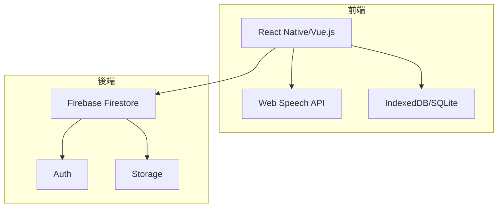

# 2-1 Vibe Coding 的流程

這個章節我們會介紹 Vibe Coding 的流程，以及如何使用 Prompt 來輔助我們進行開發。但還不是實際產出可以運作的程式碼，而是產出功能企劃書，讓我們可以更清楚地知道我們要實現什麼，以及如何實現。晚點 Vibe Coding 的實作章節，我們會再介紹如何使用 Prompt 來輔助我們進行實作。所以，先別急，我們先來看看如何產出功能「企劃書」吧。

## 2-1-1 Prompt 設計基礎

### 2-1-1-1 前言 -- 為什麼需要 Prompt 設計？

Vibe Coding 不強調程式碼實作細節，而是在於「享受創作的氛圍」。藉由 AI 的輔助，我們能將注意力從繁瑣的語法細節轉移到更高層次的設計思考上。這就像建築師專注於整體設計概念，而將施工細節交給專業團隊執行。

在傳統開發中，工程師需要花費大量時間處理與研究，以下僅為部分例子，包括但不限於：
- 語法正確性：像是變數命名、函式命名、參數命名、型別定義等。而且會安裝許多套件，來確保語法正確性，確保編譯無誤。
- 邊界條件檢查：像是 null 值、undefined 值、空字串、空陣列等。
- 程式碼風格一致性：像是命名慣例、程式碼風格、文件撰寫等。
- 底層實現細節：像是效能優化、記憶體管理、執行效率等。

而 Vibe Coding 的核心轉變在於，我們將這些「執行層面」的工作交給 AI 夥伴，自己則專注於：需求的定義、架構的設計、品質的管控、創意的表達。

1. **需求定義**：清楚表達我們想要實現什麼，並且能夠讓 AI 夥伴具體理解我們的需求。
2. **架構設計**：規劃系統的整體結構與模組劃分，確保系統的穩定性、可擴展性、可維護性。
3. **品質把控**：確保生成的程式碼符合預期，並且能夠正確運行。
4. **創意發想**：探索更多可能性與創新點子，我們將這些想法交給 AI 夥伴，請他們幫我們實現繁瑣的程式碼實作細節。

Prompt 設計是 Vibe Coding 的關鍵技能。一個好的 Prompt 應該至少要包含：明確目標、技術約束、上下文資訊。接下來我們會針對「明確目標」這部分，介紹一些 Prompt 設計的基礎，以及一些實用的技巧。

### 2-1-1-2 需求定義

先從「需求定義」開始介紹，我們需要如何定義需求，才能讓 AI 夥伴更清楚我們的需求，並且能夠正確地實現。

如果要做的功能已經相當明確，比方說「我要開發一個 Web 應用程式，讓使用者可以記錄每天的行程。可以使用表單來輸入行程，並且可以查看歷史行程」，那麼我們可以跳過這個步驟，直接進入「功能拆解」的步驟。

1. 需求定義的步驟

首先需要明確界定「我們到底要解決什麼問題」。這階段要避免技術思維，專注在商業或使用者需求層面。例如可以問這些問題：
- 使用者痛點是什麼？
- 現有解決方案不足之處？
- 預期達成的關鍵指標？

好的需求釐清可以藉由「使用者故事(User Story)」格式，幫助我們快速理解使用者的需求：
「作為[角色]，我想要[功能]，以便[價值]」
這能幫助 AI 理解上下文，後續轉化為Prompt時可加入：
"請實現一個讓使用者能...的功能，解決...問題"

舉例來說，客戶有個這樣「模糊」的需求：
「我想要可以讓使用者記錄每天的行程」

這時候我們可以先依照以上步驟釐清核心目標：
- 使用者痛點是什麼？ 是想要紀錄每天的什麼行程？ 使用者為什麼會想要紀錄？
- 現有解決方案不足之處？ 用 Google Doc 或 Google Calendar 記錄，不夠直覺，不夠方便。
- 預期達成的關鍵指標？ 希望可以快速記錄，並且可以查看歷史行程。

如果將以上目標釐清之後，轉化為 Prompt，可以這樣寫：
「作為使用者，我想要可以記錄每天的行程，以便快速記錄，並且可以查看歷史行程」

藉由如此步驟，我們可以更清楚地知道使用者的需求，並且能夠讓 AI 夥伴更清楚我們的需求，並且能夠正確地實現。

2. 拆解功能模組

接著是拆解功能模組，我們需要將大需求分解為可獨立開發的「模塊」，這個模塊不見得是指實作的程式碼，而是指一個個可以獨立開發的「功能」。

一個大功能可以拆解為多個小功能，每個小功能可以獨立開發，並且可以合併在一起，形成一個完整的大功能。在拆解功能模組的過程中，我們需要將相對複雜且「混在一塊」的需求，分解成多個獨立且可管理的單元。這個階段還不用考慮技術實現，只需要考慮功能需求。不懂技術的你我，也可以試著想像，如果今天我們要開發一個行程管理應用程式，我們需要哪些功能？

這種做法不僅能讓開發過程更加清晰，也能讓 AI 更容易理解並實現每個功能模塊。以上面提到的例子來說，如果我們要開發一個行程管理應用程式，藉由剛剛提煉出來的使用者故事：「作為使用者，我想要可以記錄每天的行程，以便快速記錄，並且可以查看歷史行程」，我們可以很粗略地將其拆解為幾個功能模組：

- 快速紀錄：「行程輸入模組」
- 儲存：「行程儲存模組」
- 顯示歷史紀錄：「行程顯示模組」

每個模組都應該有明確的輸入和輸出，例如行程輸入模組接收使用者的文字輸入，輸出結構化的行程資料；行程儲存模組則接收這些結構化資料，負責將其持久化儲存；最後行程顯示模組從儲存系統取得資料，以易讀的方式呈現給使用者。這種拆解方式符合單一職責原則，每個模組只做一件事，並且做好這件事。

在實際操作中，我們可以先讓 AI 實現核心模組，再逐步擴展周邊功能。例如先完成行程的增刪改查基本功能（備註：增刪改查是程式方面的後端，其最基本的功能之一），再添加如分類標籤、提醒通知等進階功能。這種漸進式的開發方式不僅能降低複雜度，也能讓我們在每個階段都獲得可運行的成果，便於及時調整和優化。

好的模組拆解是成功實現複雜需求的關鍵，它能讓 AI 輔助開發的過程更加流暢和高效。

3. 解決方案設計：功能拆解之後，我們需要設計「實際的解決方案」，確保每個小功能都能夠正確地實現，並且串接在一起，可以正確形成一個完整的大功能，以達到使用者需求。

在設計解決方案階段，我們需要將抽象的需求轉化為具體的實現方案。這個過程需要考慮技術可行性、系統架構和使用者體驗等多方面因素。以行程管理應用為例，我們需要決定如何實現「行程輸入」、「儲存」和「顯示」這三個核心模組。首先，行程輸入模組可以採用自然語言處理技術，讓使用者用日常語言輸入行程（如「明天下午三點與客戶開會」），這方面都是可以在前期設計的時候，就先跟客戶做好討論，讓客戶先提供一些範例，下 Prompt 的時候才能產出足夠精準的實作。

這時候「快速記錄」的需求，我們想到可以藉由「自然語言處理」技術來實現，但這只是其中一個解決方案，我們還需要考慮其他可能的可能性，這邊可以先創意發想一番，再來討論哪個解決方案最適合。除了直接問客戶，當然也可以上網找資料，或是直接請 AI 夥伴幫忙提供建議，等確定解決方案後，再來設計該怎麼下 Prompt。

解決方案的技術實現需要平衡理想與現實。比方說，在儲存模組的設計上，我們可以選擇本地儲存或雲端同步。本地儲存適合注重隱私和離線使用的場景，而雲端同步則能實現跨裝置存取。考慮到現代使用者的多裝置使用習慣，混合式儲存方案可能更為理想 - 核心數據本地儲存確保即時性，同時定期同步到雲端備份。在技術選擇上，對於前端可以使用 React 或 Vue 等現代框架實現響應式界面，後端則可考慮 Firebase 或自建 API 服務。這些決策需要基於團隊技術能力、專案時程和長期維護成本綜合考量。

以上只是一些常見的解決方案，實際上遠遠不僅於此，只是先提供一些常見的解決方案，讓大家有個概念。實務上還要取決於時間、成本、技術能力等因素，來決定最適合的解決方案，這部分在後續的篇章會有更詳細的介紹。

最後，解決方案的設計必須考慮擴展性和維護性，要稍微考慮到「未來」可能會有的需求，這樣在設計的時候，才能夠有足夠的彈性，不會在未來一旦遇到瓶頸，要修改起來就不是兩三句 Prompt 就可以解決的。甚至還需要工程師「親自介入」去針對程式碼大動干戈，這樣就失去 Vibe Coding 的意義了。

### 2-1-1-3 Do and Dont -- 需求定義的技巧

接下來介紹一些需求定義的技巧，幫助大家更清楚地定義需求，並且能夠讓 AI 夥伴更清楚我們的需求，並且能夠正確地實現。其實就是將上面提到的步驟，再更詳細介紹其中具體是如何「做出來」的。

1. 不要過度強調技術細節，而是要關注使用者需求

關鍵在於，我們需要先釐清使用者需求，再來考慮技術實現。如果是有經驗的工程師，可能會先考慮技術實現，再來考慮使用者需求，這樣可能會忽略使用者真正的需求，導致實作出來的東西，不是使用者想要的。

經驗豐富的工程師常常有個毛病，會從一開始聽到客戶的需求，就會先考慮技術實現，腦中就開始浮現畫面該如何實現，後端該怎麼寫，前端該怎麼寫，甚至連 UI 該怎麼設計都想好了。

而且不自覺得，會拿現有產品或是自己以前做過「類似」的產品，來跟客戶討論，這倒是沒有什麼不好，只是需要小心，不要被自己的故有經驗牽著鼻子走，而是要引導客戶，讓客戶能夠更清楚自己真正想要的是什麼。
這其實有點像是 PM 或是 Product Owner 的在做的事，需要能夠「站在使用者角度」思考，而不是想著到時候怎麼實現，出現了 OOXX 情況該怎麼處理，主機該怎麼架設...等那些之為末節。在 Vibe Coding 的流程中，我們更應該專注於「使用者想要解決什麼問題」，而不是「我們能用什麼技術解決」。這種思維轉變是成功運用 AI 輔助開發的關鍵。

舉例來說，當使用者提出「想要快速記錄行程」的需求時，傳統開發者可能會立即想到要使用哪種資料庫、如何設計 API；但在 Vibe Coding 中，我們應該先思考的是：使用者在什麼情境下會需要快速記錄？是通勤時單手操作？還是會議中需要速記？這些使用場景會直接影響我們給 AI 的 Prompt 設計方向。

好的需求定義應該包含三個層面：使用者角色、使用情境和價值主張。
1. 使用者角色：誰會使用這個功能？
2. 使用情境：在什麼情況下使用？
3. 價值主張：這個功能為使用者解決了什麼痛點？

例如：「作為經常外出拜訪客戶的業務人員（角色），當我在計程車上突然接到會議通知時（情境），希望能用語音快速記錄行程，避免手忙腳亂翻找紙筆（痛點）。」這樣具體的描述，能讓 AI 生成更貼近實際需求的解決方案。

在需求定義階段，我們要像「偵探」（或者說是徵信社？）一樣挖掘使用者真正的需求，而不是像工程師一樣急著找解法。這種「問題導向」而非「技術導向」的思維，可說是 Vibe Coding 與傳統開發最大的不同之處。

其他更詳細的 Prompt 設計原則，會在後續的章節做介紹，會提到更多實用的技巧，幫助你在 Vibe Coding 的過程中，更加得心應手。

2. 拆解功能模組

拆解的關鍵在於，我們需要將大需求分解為可獨立開發的「模塊」，這個模塊不見得是指實作的程式碼，而是指一個個可以獨立開發的「功能」。

主要做法，可以從使用者的使用流程來看，像是剛剛提到的行程管理應用，可以拆解為：紀錄 -> 顯示歷史紀錄。

但是你會發現，「紀錄」這個功能，又可以拆解為：輸入 + 儲存。如此一來，完整的流程就變成：輸入 -> 儲存 -> 顯示紀錄。
這時候我們就可以開始思考，這些功能該怎麼實現，以及該怎麼串接在一起。拆解功能模組是 Vibe Coding 中極為關鍵的一環，它決定了後續與 AI 協作開發的流暢度與成功率。在拆解過程中，我們需要像組裝積木一樣思考，將複雜的產品需求分解成可獨立開發、測試的最小功能單元。

這種拆解不是隨意切割，而是基於使用者旅程和使用者故事來進行邏輯性分解。以行程管理應用為例，我們可以從「使用者想要快速記錄行程」這個核心需求出發，觀察使用者在不同情境下的完整操作流程：從觸發記錄需求、輸入方式選擇、數據儲存到後續查閱，每個環節都代表一個潛在的模組切分點。這種基於使用者流程的拆解方式，能確保每個模組都有明確的輸入輸出和「獨立價值」，避免產生功能碎片或過度耦合的情況。

在實際拆解的做法上，我們可以採用「樹狀結構思考法」，從頂層需求開始逐步向下展開。首先確定核心功能（如「行程管理」），然後分解為主要功能分支（如「記錄」、「查看」、「管理」），再細分為具體操作（如「語音輸入」、「文字輸入」、「日曆顯示」、「列表顯示」等）。

[圖-1]

這種分層式拆解有助於建立清晰的模組邊界，同時也方便後續分配給不同 AI 角色（如前端專用 AI、後端專用 AI）來協同開發。特別需要注意的是，每個模組的顆粒度要適中。太小的單獨交付模組，可能會導致模組過於碎片化，不夠完整，這樣在實作的時候，會需要花更多時間去整合，這樣反而會降低開發效率；而如果模組太大，又會導致開發時間過長，這樣反而會降低開發效率，且複雜度太高，不只 Prompt 設計起來會很困難，實作的時候更加困難，一旦功能不如預期，還需要花更多時間調整，而且不見得能夠達到預期的改動。

理想的模組，Prompt 設計起來不會太困難，通常利用高階 AI 模型（e.g. Sonnet 3.7, Gemini pro...等） 可以在 10 個以內的 Prompt 中完整描述，並且能夠獨立驗證其功能完整性。例如「語音轉文字」就是一個恰當的模組粒度，它包含明確的輸入（語音）和輸出（結構化行程數據），且不需依賴其他模組即可測試基本功能。

理論上是這樣做，但實際上還是會遇到一些挑戰，例如：

模組之間的邊界模糊：有些功能可能會同時屬於多個模組，這時候需要仔細思考，該如何拆解，才能讓每個模組都有明確的輸入輸出，並且能夠獨立驗證其功能完整性。像是「紀錄」這個功能，如果相關知識比較不足的人，可能會覺得這個功能「不就這樣」，就是能夠讓使用者輸入就好了？ 但其實這個功能可以拆解為：輸入 + 儲存，因為沒有儲存的話，只算是輸入而已，稱不上說是「紀錄」。

一旦是這樣拆解，就會發現，其實「紀錄」這個功能，可以拆解為：輸入 + 儲存。模組功能之間的邊界就切出來了，輸入模組專注於接收使用者輸入（語音或文字），而儲存模組則負責將資料持久化。這樣的明確分工讓後續與AI協作時，可以分別針對不同模組給出精確的Prompt，例如「設計一個語音輸入介面」或「實現行程資料的儲存」。

依賴關係管理：有些模組可能會依賴其他模組，這時候需要仔細思考，該如何設計，才能讓每個模組都能夠正確地運作，並且能夠互相配合。像是「儲存」這個功能，如果沒有「輸入」，那麼儲存就沒有東西可以存，這樣就失去意義了。總要能夠讓使用者輸入他想要紀錄的事物，這樣才會有「紀錄」這個功能的價值。

3. 解決方案設計

最後，模組拆完，我們需要將這些模組串接在一起，形成一個完整的大功能。這時候我們需要考慮，該如何設計，才能讓每個模組都能夠正確地運作，並且能夠互相配合。

解決方案設計的核心在於建立模組間的互動機制。想像每個模組都是一位專業的團隊成員，這個成員只負責做單一功能，它們需要明確知道何時該做什麼事情。以行程管理應用為例，如果當初選用「語音輸入」作為輸入的模組，要設計當他完成工作後，它需要將轉換後的文字傳遞給「儲存」模組，同時設想錯誤處理機制能妥善應對各種邊界情況。這種模組之間的互動設計思維讓 AI 能更精確理解模組間的協作關係，進而生成更符合實際的整合代碼。

而在「解決方案設計」的實際操作上，需要兼顧「技術可行性」與「使用者體驗流暢度」。我們常犯的錯誤是過度專注於單一模組的最佳化，卻忽略了模組間過渡的順暢性。例如在設計「語音輸入」與「日曆顯示」模組的銜接時，除了考慮技術面的API呼叫，更需思考使用者在完成語音輸入後，系統該如何自然過渡到日曆界面？是否需加入視覺反饋或過場動畫？這些細節的設計往往決定了產品的整體質感。透過在 Prompt 中明確描述這些過渡需求，AI 能生成更貼近人性的解決方案。

最後，關鍵的設計原則是「保持擴展性與簡潔性的平衡」。說起來簡單，做起來卻需要細膩的拿捏。擴展性代表著系統能夠從容應對未來的需求變化，這通常意味著需要預留一些抽象和轉圜的餘地，以便未來繼續做功能的更新、修改；而簡潔性則要求我們避免過度設計，盡量只實現必要的功能而已。

在 Vibe Coding 中，我們可以透過「漸進式設計」來達成這種平衡 - 先實現核心功能的最小可行版本，再根據實際需求逐步擴展。例如在行程管理應用中，初期可能只需要基本的文字輸入、本地端存入文字和文字顯示功能，但我們可以在設計資料時，預想位置、日期等資訊，為未來可能增加的「地圖顯示」或是「時間顯示」功能做準備，同時不讓現有系統變得複雜。

這種平衡的藝術也體現在模組間的耦合度控制。這種方式既確保了系統整合的順暢，又為未來優化保留了空間。好的設計很難一次到位的完美，而是在迭代過程中持續保持微妙的平衡，確保系統的擴展性與簡潔性。

如此一來，接下來我們就可以開始設計 Prompt 了！ 這時候我們可以先讓 AI 實現核心模組，再逐步擴展周邊功能。例如先完成行程的增刪改查基本功能，再添加如地圖標示、時間提醒通知等進階功能。這種漸進式的開發方式不僅能降低複雜度，也能讓我們在每個階段都獲得可運行的成果，便於及時調整和優化，

--> 七頁

## 2-1-2 產出可以運作的「操作手冊」

承接上一個段落的內容，我們已經完成了需求定義，接下來我們需要將這些需求轉化為可以運作的「代碼」。這個過程中，我們需要考慮到技術選用、功能拆解、解決方案設計，最後才是實際產出可運作的程式碼。

在 Vibe Coding 中，我們需要考慮到技術選用，這個部分我們會在後續的章節做介紹，會提到更多實用的技巧，幫助你在 Vibe Coding 的過程中，更加得心應手。

### 2-1-2-1 技術選用

我不確定我要用什麼技術來做，只知道應該要能夠讓使用者輸入文字來記錄每天的行程，除了問 Google 之外，我還可以問 AI，例如：
```
我想要做一個可以讓使用者輸入文字來記錄每天的行程的應用，請問我應該用什麼技術來做？
使用者故事舉例如下：「作為經常外出拜訪客戶的業務人員（角色），當我在通勤時間想要記錄行程（情境），希望能快速記錄當下的想法，避免手忙腳亂翻找紙筆（痛點）。」
```

產出的結果如下，我利用多次 Prompt 得到的結果，再請 AI 幫忙做統合，最後綜合出這份頗為完整的技術選型建議：

```
根據你的需求（快速記錄行程的應用，適合業務人員在通勤時使用），以下是技術建議和實現方向：

---

### **1. 技術選型建議**
#### **前端（使用者介面）**
- **React Native** 或 **Flutter**：
  - 適合開發跨平台（iOS/Android）的移動應用，提供流暢的用戶體驗。
  - 優點：一次開發，多平台部署；支援離線功能。
- **純 Web 應用（React/Vue.js）**：
  - 如果不需要複雜的移動功能，可以開發 PWA（漸進式網頁應用），支援離線使用和添加到主畫面。

#### **後端（資料儲存與同步）**
- **Firebase**：
  - 提供即時資料庫（Firestore）、身份驗證（Auth）、和雲端儲存（Storage）。
  - 優點：無需自建伺服器，快速開發，適合小型到中型應用。
- **Supabase**：
  - 開源替代方案，提供 PostgreSQL 資料庫和即時 API，適合需要更多控制權的開發者。

#### **語音輸入功能**
- **Web Speech API**（Web 應用）或 **原生 SDK**（如 iOS 的 SiriKit、Android 的 SpeechRecognizer）：
  - 實現語音轉文字功能，方便使用者快速記錄。

#### **離線支援**
- **本地儲存**：
  - 使用 SQLite（移動應用）或 IndexedDB（Web 應用）儲存資料，確保無網路時仍可記錄。
- **同步機制**：
  - 當網路恢復時，自動將本地資料同步到雲端（如 Firebase）。

---

### **2. 功能設計**
#### **核心功能**
1. **快速輸入**：
   - 文字輸入框 + 語音輸入按鈕。
   - 支援標籤或分類（如「客戶拜訪」、「會議」）。
2. **時間記錄**：
   - 自動記錄輸入時間，或讓使用者手動選擇時間。
3. **離線支援**：
   - 確保通勤時（可能無網路）仍可記錄。
4. **同步與備份**：
   - 登入後自動同步到雲端，避免資料遺失。

#### **進階功能（可選）**
- **提醒功能**：根據行程時間發送通知。
- **統計報表**：分析行程分佈或完成率。
- **匯出功能**：將行程匯出為 CSV 或 PDF。

---

### **3. 開發步驟**
1. **原型設計**：
   - 用 Figma 或 Adobe XD 設計介面，確認使用者流程。
2. **前端開發**：
   - 實現輸入介面、語音功能、本地儲存。
3. **後端整合**：
   - 設定 Firebase/Supabase，處理同步與登入。
4. **測試與優化**：
   - 測試離線場景和同步機制，確保穩定性。

---

### **4. 範例技術堆疊**
```markdown
- **前端**：React Native (跨平台) 或 Vue.js (PWA)
- **後端**：Firebase (Firestore + Auth)
- **語音輸入**：Web Speech API 或原生 SDK
- **本地儲存**：SQLite (移動應用) 或 IndexedDB (Web)
```

產出的結果雖然很多很完整，但是進一步就是問自己「我該怎麼做？」，不是一味照 AI 生成的內容照做。這時候更需要進一步提問，比方說：如果我預算只有 10 萬，而且開發時間只有 1 個月，我該怎麼做？ 

這樣就可以得到更詳細且更為「個人化」的技術選型建議，就可以透過這樣的技術選型，來進行後續的開發。至於該怎麼選型，這部分在後續完整製作的章節，會有比較詳盡的介紹。

### 2-1-2-2 功能拆解

上一步驟，我們已經得到了技術選型建議，接下來我們需要將這些技術選型轉化為可以運作的「功能模組」。做了技術選型，挑選了前端、後端技術之後，以及選了初步想要做的語音輸入功能，接下來我們需要將這些技術選型轉化為可以運作的「單一模組」。

這個部分，我們可以利用 AI 來幫忙，例如將功能大致上分為「前端」畫面部分，以及後端資料儲存部分：

- 前端（語音）輸入和顯示部分，選用 Vue.js 來做，請問我該怎麼拆解前端功能？
- 後端資料儲存讀取部分，選用 Firebase 來做，請問我該怎麼拆解後端功能？

但這樣還不夠細，可以請 AI 幫忙將相對較大的功能模組，拆得更小更細，當然也是可以請 AI 幫忙想得更細。
Prompt 的部分，要將完整的「需求」脈絡一同餵給 AI 做理解，生成才會足夠精準。

```
使用者故事舉例如下：「作為經常外出拜訪客戶的業務人員（角色），當我在通勤時間想要記錄行程（情境），希望能快速記錄當下的想法，避免手忙腳亂翻找紙筆（痛點）。」

我選用的技術的大項目如下，請幫我將每個大項目，以此故事需求，來將每項目該做的事，拆成更細的功能模組。

- 前端（語音）輸入和顯示部分，選用 Vue.js 來做，請問我該怎麼拆解前端功能？
- 後端資料儲存讀取部分，選用 Firebase 來做，請問我該怎麼拆解後端功能？
```

這樣就可以得到更詳細且更為「個人化」的功能拆解建議，但 AI 給的結果不盡滿意，可能 AI 會給出太過詳細，或是太過簡單的結果。在經過幾次詢問之後，精煉出以下結果：

```
### **前端（Vue.js）功能模組**  
- **輸入模組**  
  - 語音輸入  
    - Web Speech API 整合  
    - 重錄與確認按鈕  
  - 文字輸入  
    - 極簡輸入框（自動聚焦）  
    - 快捷標籤（`#` 分類提示）  
  - 時間標記  
    - 自動附加當前時間  
    - 手動修改選項  

- **顯示模組**  
  - 即時預覽  
    - 格式化內容顯示  
  - 行程列表  
    - 時間倒序排列  
    - 標籤篩選功能  

- **離線處理模組**  
  - 本地暫存  
    - `IndexedDB` 或 `localStorage`  
  - 同步狀態提示  
    - 網路恢復時通知  

---

### **後端（Firebase）功能模組**  
- **資料儲存模組**  
  - Firestore 結構設計  
    - 使用者 ID、內容、時間戳、標籤  
  - 離線寫入優先  
    - 標記 `isSynced` 狀態  

- **同步模組**  
  - 衝突處理  
    - 以最後更新時間為準  
  - 增量同步  
    - 僅同步未上傳記錄  

- **安全規則**  
  - 權限控制  
    - 使用者僅能存取自己的資料  

- **語音備份模組（可選）**  
  - Firebase Storage 儲存錄音檔  

---

### **前後端協作流程**  
1. 輸入行程 → 暫存至 `IndexedDB`（標記 `isSynced: false`）  
2. 網路恢復 → 批次同步至 Firestore  
3. 多裝置同步 → Firestore 即時監聽更新  

---

### **功能優先級**  
- **MVP 版本**  
  1. 語音 + 文字輸入  
  2. Firestore 基本同步  
  3. 離線支援  

- **進階版本**  
  1. 語音備份  
  2. 統計報表  

--- 

精簡完畢！需要調整或補充嗎？

```

好了，功能模組拆解出來了，但還不知道該怎麼把各個模組串接起來。每一個組塊都是單獨運作，即便單一功能都完成了，但我們還不知道怎麼將輸入模組跟儲存模組串在一起，使其成為一個可以成功運作的系統。

當我們已經將系統拆解為獨立運作的模組後，接下來最重要的就是設計模組間的「互動協議」和「資料流」。這就像組裝樂高積木，單個積木再完美，若沒有正確的連接方式也無法組成完整的作品。

### 2-1-2-3 解決方案設計

上個段落已經提過關鍵的技巧，接下來就是將這些模組串接起來，形成一個完整的大功能。這時候我們需要考慮，該如何設計，才能讓每個模組都能夠正確地運作，並且能夠互相配合。

我這邊 Prompt 這樣設計：
```
最後，模組拆完，我們需要將這些模組串接在一起

{剛剛生成的功能模組拆解}

幫我根據以上模組功能設計，設計模組功能串接的「解決方案」，以 1000 ~ 2000 字撰寫，依照結構性良好的序列清單來撰寫。
```

產出結果範例如下：

```
### 模組串接解決方案設計

1. **核心資料流設計**
   - **觸發機制**  
     - 輸入模組完成後自動觸發儲存流程  
     ```javascript
     // Vue.js 範例
     methods: {
       handleInputComplete(data) {
         this.$emit('save-request', {
           content: data.text,
           timestamp: new Date(),
           tags: this.extractTags(data.text)
         });
       }
     }
     ```
   - **資料格式標準化**  
     - 統一使用 JSON 格式傳遞  
     ```json
     {
       "userId": "user_123",
       "content": "與客戶會議",
       "timestamp": "2023-11-20T10:00:00Z",
       "tags": ["#會議"],
       "isSynced": false
     }
     ```

2. **前端模組串接**
   - **輸入 → 本地儲存流程**  
     1. 語音/文字輸入完成  
     2. 自動附加時間戳  
     3. 呼叫離線處理模組 API  
     ```javascript
     // IndexedDB 操作範例
     async function saveToLocalDB(record) {
       const db = await openDB('ScheduleDB', 1);
       await db.add('records', record);
       EventBus.emit('local-save-complete');
     }
     ```

3. **同步機制設計**  
   - **離線優先策略**  
     - 網路狀態監聽器觸發同步  
     ```javascript
     window.addEventListener('online', () => {
       syncManager.checkPendingRecords();
     });
     ```
   - **衝突解決流程**  
     1. 比對本地與遠端最後修改時間  
     2. 採用「最後寫入勝出」策略  
     3. 更新同步狀態標記  

4. **錯誤處理架構**  
   - **分層錯誤捕捉**  
     ```javascript
     try {
       await syncToCloud();
     } catch (err) {
       if (navigator.onLine) {
         ErrorLogger.report(err);
       } else {
         RetryQueue.add(syncToCloud);
       }
     }
     ```

5. **可擴展接口設計**  
   - **模組通訊協議**  
     ```typescript
     interface IModuleEvent {
       module: 'input' | 'storage';
       event: 'complete' | 'error';
       payload: Record<string, any>;
     }
     ```
   - **事件總線實現**  
     ```javascript
     class EventBus {
       static emit(event: string, payload?: any) {
         window.dispatchEvent(new CustomEvent(event, { detail: payload }));
       }
     }
     ```

6. **效能優化要點**  
   - **批量處理策略**  
     - 本地修改累積達 5 筆或閒置 30 秒後觸發同步  
   - **差異化同步**  
     - 僅傳輸變更字段而非完整記錄  

7. **監控與日誌**  
   - **關鍵指標追蹤**  
     ```javascript
     const metrics = {
       syncSuccess: 0,
       syncFailed: 0,
       avgSyncTime: 0
     };
     ```

8. **測試方案**  
   - **模組整合測試案例**  
     ```javascript
     describe('輸入到儲存整合流程', () => {
       it('應完成端到端資料流', async () => {
         await simulateVoiceInput('測試行程');
         expect(getLocalRecord()).toMatchObject({
           content: '測試行程'
         });
       });
     });
     ```

### 關鍵設計原則
1. **單向資料流**  
   - 嚴格遵循「輸入 → 處理 → 儲存 → 同步」流向  
2. **鬆耦合架構**  
   - 模組間僅透過事件通訊，避免直接依賴  
3. **冪等性設計**  
   - 同步操作可安全重試而不產生副作用  
4. **可觀察性**  
   - 每個模組暴露狀態查詢接口  

```

在技術方案設計完成後，我們可以從幾個維度來檢視 AI 的解決方案是否符合需求：

**架構完整性檢視**  
從宏觀角度審視方案是否涵蓋所有關鍵。以語音輸入系統為例，需確認從聲音輸入提取到文字轉換的完整流程是否能夠無縫銜接，如果不行做到滿意的結果，可能在解決方案的設計時，就要先準備「Plan B」，請 AI 再提供不同的解決方案。畢竟可能不熟悉這方面的技術，所以先準備好備案，避免在後續的開發過程中，發現問題時，才來進行調整。

**技術可行性驗證**
評估各技術選型的合理性，假設選用語音輸入，我們透過初步研究調查，知道平均每筆語音資料大小為 50KB（舉例而已，實際上不見得是這個數字），而每一筆語音輸入，需權衡資源佔用與作業時間延遲的容忍度。如果選用差異化同步機制，則要測試這種做法是否能在 容忍度的延遲範圍內（例如 10ms） 內完成語音輸入的文字轉換。

如果試驗之後，還是做不到滿意的結果，還要請 AI 進行調整，拿出我們的 Plan B 這個備案作為解決方案。

**業務契合度評估**  
將技術方案回推到原始需求，看看是否符合使用者預期的核心需求。例如效能優化是有必要的嗎？ 差異化同步聽起來不錯，但多做這樣的優化，是否有帶來足夠的業務效益？

這種檢討方式能暴露出潛在的過度設計或不足之處。例如當發現語義理解模組在測試案例中未被充分驗證時，需補充多輪對話情境的測試腳本。同時可以建立「技術負債看板」，先標記「檢討中發現」但暫不修正的問題，如未來需重構的快速實現代碼，或是日後可以再著手進行優化的功能需求。如果發現之後都沒有這樣的優化需求，那麼這樣的優化，可能就不需要了，這時候就可以先跳過，先完成核心功能再說囉。

以上提的幾個維度，可以幫助我們檢視 AI 的解決方案是否符合需求，如果符合需求，那麼就可以進行下一步實作來進行產品的開發，如果不符合需求，那麼就可以請 AI 進行調整，直到切合最基本的業務需求為止。


### 2-1-2-4 產出完整企劃文案

最後，統合以上幾個段落產出的內容，餵給 AI 產出初步的產品開發企劃文案。讓我們可以先進行產品開發的規劃，以便預估成本，以及後續的開發時程。比起傳統的產品開發流程，這樣的流程可以讓我們更快速地進行產品開發初步評估，更快速進行產品開發與迭代。

以下是 AI 產出的產品開發企劃文案範例：

```
以下是一份結構化的產品開發企劃書，整合了技術選型、功能模組設計與解決方案設計，並以專業的企劃格式呈現：

---

# **產品開發企劃書**  
**專案名稱**：智能行程記錄與同步應用  
**版本**：1.0  
**日期**：2025 年 5 月 20 日  

---

## **1. 專案概述**  
### **1.1 目標**  
開發一款支援語音與文字輸入的行程記錄應用，重點解決使用者在通勤或無網路環境下的快速記錄需求，並提供跨平台同步與離線支援功能。  

### **1.2 目標用戶**  
- 商務人士  
- 遠端工作者  
- 需頻繁記錄行程的專業人士  

### **1.3 核心價值**  
- **快速記錄**：語音與文字雙輸入模式。  
- **離線優先**：無網路時仍可記錄，自動同步至雲端。  
- **跨平台支援**：iOS、Android 與 Web 端無縫體驗。  

---

## **2. 技術選型**  
### **2.1 前端技術**  
| 平台     | 技術選型     | 關鍵功能                       |
| -------- | ------------ | ------------------------------ |
| 移動應用 | React Native | 跨平台開發、原生語音 SDK 整合  |
| Web 應用 | Vue.js (PWA) | 漸進式網頁應用、Web Speech API |

### **2.2 後端技術**  
| 服務     | 技術選型           | 用途                   |
| -------- | ------------------ | ---------------------- |
| 資料庫   | Firebase Firestore | 即時同步、離線優先設計 |
| 身份驗證 | Firebase Auth      | 使用者登入與權限管理   |
| 本地儲存 | SQLite/IndexedDB   | 離線資料暫存           |

### **2.3 第三方整合**  
- **語音輸入**：Web Speech API (Web)、原生語音 SDK (移動端)。  
- **分析工具**：Google Analytics for Firebase (使用者行為追蹤)。  

---

## **3. 功能設計**  
### **3.1 核心功能**  
| 功能模組     | 說明                                                 |
| ------------ | ---------------------------------------------------- |
| **輸入模組** | 支援語音轉文字、快捷標籤 (`#會議`)、自動時間戳記。   |
| **儲存模組** | 離線時暫存至本地資料庫，網路恢復後同步至 Firestore。 |
| **同步模組** | 衝突解決策略（以最後修改時間為準）、增量同步。       |

### **3.2 進階功能（Phase 2）**  
- **語音備份**：將錄音檔上傳至 Firebase Storage。  
- **統計報表**：行程完成率與時間分佈分析。  

---

## **4. 系統架構**  
### **4.1 資料流設計**  


### **4.2 技術架構圖**  


---

## **5. 開發時程**  
| 階段         | 週數 | 交付物                         |
| ------------ | ---- | ------------------------------ |
| **需求分析** | 1    | 功能規格書、原型設計           |
| **前端開發** | 4    | 輸入介面、本地儲存模組         |
| **後端開發** | 3    | Firestore 整合、同步邏輯       |
| **測試優化** | 2    | 壓力測試、使用者驗收測試 (UAT) |

---

## **6. 風險管理**  
| 風險               | 緩解策略                       |
| ------------------ | ------------------------------ |
| 語音辨識準確度不足 | 提供文字編輯覆蓋功能           |
| 離線同步衝突       | 明確衝突解決策略（時間戳優先） |
| 跨平台效能差異     | 針對 iOS/Android 進行個別優化  |

---

## **7. 預算與資源**  
| 項目       | 預算（人月） |
| ---------- | ------------ |
| 前端開發   | 3            |
| 後端開發   | 2            |
| 測試與部署 | 1            |

---

## **8. 成功指標**  
- **短期**：上線後 3 個月內達成 10,000 次下載。  
- **長期**：使用者留存率 ≥ 60% (6 個月後)。  

---

## **9. 附錄**  
- **原型設計**：Figma 連結  
- **技術規格**：API 文件與資料庫 Schema  

--- 

此企劃書可作為開發團隊與利害關係人的溝通藍圖，並根據實際需求調整細部內容。

```
```


## 2-1-3 檢視與調整

最後，檢視 AI 產出的企劃書內容，看看是否符合需求。這步驟很重要，因為這樣可以確保我們的產品開發方向是正確的，避免走冤枉路。而且 AI 的幻想時不時會出現，所以需要我們自己來檢視，避免 AI 「加油添醋」成為我們開發時的負擔。以為已經在 Prompt 中講好需求，但 AI 產出的企劃書內容，可能還是會有偏離當初所要求的地方，不得不靠自己來把關。

修改方式最好是在同一個 Prompt 中進行，讓 AI 模型可以充分了解當下的需求脈絡，透過 Prompt 修改才容易一次到位。比方說，我覺得本地儲存還是不用做，那麼我們可以這樣告訴 AI：

```
我覺得本地儲存還是不用做，請你幫我調整一下，企劃書部分不要提及本地儲存。
```
藉由這樣反覆調整直到符合需求為止，這樣再 Vibe Coding 的過程中，我們可以更快速且精準進行產品開發。一旦確認符合需求，那麼就可以進行下一步實作來進行產品的開發，如果不符合需求，那麼就可以請 AI 進行調整，直到切合最基本的業務需求為止。

---

# 2-2 如何理解與應用 AI 工具

理論講了這麼多，到現在都還沒開始寫程式，是不是覺得很無聊，手有點癢？

別急，這一章節開始，我們就要開始「寫程式了！」

## 2-2-1 以 Cursor IDE 為例

簡單介紹一下 Cursor IDE 這個工具，它是一款推出的 AI 驅動的開發工具，它結合了 AI 的強大功能，以及開發工具的便利性，讓開發者可以更快速地開發出高品質的程式碼。

其基底是建立在 VS Code 之上，所以如果你已經習慣使用 VS Code 的話，Cursor IDE 會是一個不錯的選擇。

之所以會推薦這個工具，一來是因為它本身可以免費試用，二來是因為我自己也用得比較有心得了，而市面上也有許多關於它的教學，所以推薦給大家。此外，比較了現在市面上許多 AI 驅動的開發工具，Cursor IDE 算是比較成熟且穩定的工具，而且大多數 AI IDE 都大同小異，所以就選擇這個比較工具來進行教學。

簡單來說，就是一款「比較聰明」的 VS Code，它會根據你的需求，自動生成程式碼，並且提供即時的提示，讓你更容易開發出高品質的程式碼。

## 2-2-2 AI 工具的最佳化

俗話說得好，工欲善其事，必先利其器。

要使用工具之前，我們需要先了解工具的特性，才能讓它更符合我們的需求。首先了解一些基礎用法，接著就教大家如何調整「設定」，讓 AI 產出最佳化。

雖然說 Cursor IDE 是一款比較聰明的 VS Code，但是它還是有一些地方需要我們自己來調整，才能讓它更符合我們的需求。

### 2-2-2-1 基本用法

1. 行內提示：可以透過 `Ctrl + K (Windows)` 或 `Cmd + K (Mac)` 叫出 Prompt 輸入框，輸入提示。
   1. 主要用於在程式碼中，快速生成程式碼。
   2. 生成 / 細部調整 / 細部重構 / 解釋程式碼，主要用於細部修改調整。
   3. 缺點是針對單一程式碼片段進行提示，AI 難以針對整體專案進行脈絡的通盤了解，生成的內容較為局限。
2. 全域提示：可以透過 `Ctrl + Shift + L (Windows)` 或 `Cmd + Shift + P (Mac)` 叫出 Prompt 輸入框，輸入提示。
   1. 主要用於在整體專案中，快速生成程式碼。
   2. 生成 / 改寫重構 / 跨檔案重構 / 解釋程式碼，主要用於整體專案的脈絡了解，生成的內容較為全面且能夠跨檔案修改與生成。
   3. 缺點是全域提示容易「改太多」，需要自行進行設定停損點，避免 AI 還沒有把新功能做好，就先改壞舊有的功能。

基本上 Vibe Coding 就是靠著這兩個功能來進行，所以這兩個功能一定要熟練。

### 2-2-2-2 Cursor IDE 的共用提示設定

撰寫 `.cursorrules` 檔案，可以讓 Cursor IDE 更了解你的需求，進而產出更符合你需求的程式碼。不僅是「更快」而已，更精準的產出，可以讓你更省時省力，達到事半功倍的效果。

產出 `.cursorrules` 檔案，其實很簡單，只要在 Cursor IDE 中，按下 `Ctrl + K` 叫出 Prompt 輸入框，輸入提示。
簡單是簡單，但在產出之前，要先釐清 .cursorrule 要為什麼樣的專案服務，建議可以先從專案的目標、需求、規格、設計、架構、風險、預算、資源等，這些方向來進行思考，至於思考的方式，就是上個小章節提到的整個流程。至少要先想好整個專案的目標、需求和規格，這樣產出的 .cursorrule 才會更符合專案的需求。


```
請幫我產出 Web 前端的 `.cursorrules` 檔案，要求如下：

- 專案名稱：智能行程記錄與同步應用
- 專案目標：開發一款支援語音與文字輸入的行程記錄應用，重點解決使用者在通勤或無網路環境下的快速記錄需求，並提供跨平台同步與離線支援功能。
- 專案需求：
  - 支援語音轉文字、快捷標籤 (`#會議`)、自動時間戳記。
  - 離線時暫存至本地資料庫，網路恢復後同步至 Firestore。
  - 衝突解決策略（以最後修改時間為準）。

- 專案規格（Web 前端）：
  - 使用 Vue.js 開發。
  - 使用 Firebase 作為後端服務，包括 Firestore、Auth、Storage。
  - 使用 Web Speech API 作為語音輸入。
  - 使用 Figma 作為原型設計工具。
  - 使用 Google Analytics 作為分析工具。

- 專案架構
  - 前端：Vue.js
  - 後端：Firebase
  - 分析：Google Analytics
```

產出的結果如下所示意，會發現 AI 產出的 rule 有些過於「詳細」，這時候我們可以進行調整，讓 AI 產出的 rule 更符合專案的需求。像是 e2e 的測試，我們可以先不考慮，先讓 AI 產出基本的程式碼，以整合測試為主就好，而不必急著產出 e2e 測試。
```

```json
{
  "projectContext": {
    "name": "智能行程記錄與同步應用",
    "purpose": "支援語音與文字輸入的行程記錄應用，解決通勤或無網路環境下的快速記錄需求",
    "features": ["語音轉文字", "離線支援", "跨平台同步", "快捷標籤", "自動時間戳記"],
    "techStack": ["Vue.js", "Firebase", "Web Speech API", "IndexedDB", "PWA"]
  },
  "codingStandards": {
    "general": {
      "indentation": 2,
      "maxLineLength": 100,
      "semiColons": true,
      "quotes": "single",
      "trailingComma": "es5"
    },
    "vueSpecific": {
      "componentStyle": "composition-api",
      "componentNaming": "PascalCase",
      "propsDefinition": "typed",
      "componentOrganization": [
        "props", "emits", "setup", "data", "computed", "methods", "watch", "lifecycle"
      ]
    },
    "namingConventions": {
      "components": "PascalCase",
      "directives": "camelCase",
      "variables": "camelCase",
      "constants": "UPPER_SNAKE_CASE",
      "files": "kebab-case"
    }
  },
  "architecture": {
    "folderStructure": {
      "src": [
        "assets",
        "components",
        "composables",
        "views",
        "router",
        "store",
        "services",
        "utils",
        "types"
      ],
      "components": ["ui", "forms", "layout", "features"],
      "services": ["firebase", "speech", "sync", "analytics"]
    },
    "patterns": {
      "dataFetching": "composables",
      "stateManagement": "pinia",
      "errorHandling": "global-error-handler",
      "offline": "service-worker"
    }
  },
  "firebase": {
    "services": ["firestore", "auth", "storage"],
    "conventions": {
      "collections": "camelCase",
      "documents": "auto-id",
      "queries": "composables"
    },
    "dataModels": {
      "schedule": {
        "content": "string",
        "timestamp": "timestamp",
        "tags": "array",
        "userId": "string",
        "lastModified": "timestamp",
        "isSynced": "boolean"
      }
    }
  },
  "offlineSupport": {
    "strategy": "offline-first",
    "storage": "indexedDB",
    "syncMechanism": "background-sync",
    "conflictResolution": "last-write-wins"
  },
  "speechRecognition": {
    "api": "Web Speech API",
    "fallback": "manual-input",
    "languages": ["zh-TW", "en-US"]
  },
  "performance": {
    "lazyLoading": true,
    "codeChunking": true,
    "imageOptimization": true,
    "fontOptimization": true,
    "caching": {
      "static": true,
      "api": true,
      "userContent": true
    }
  },
  "testing": {
    "unit": {
      "framework": "vitest",
      "coverage": 70
    },
    "e2e": {
      "framework": "cypress",
      "criticalPaths": ["schedule-creation", "offline-sync"]
    }
  },
  "accessibility": {
    "wcag": "AA",
    "semanticMarkup": true,
    "keyboardNavigation": true,
    "aria": true
  },
  "i18n": {
    "defaultLocale": "zh-TW",
    "supported": ["zh-TW", "en-US"]
  },
  "deployment": {
    "hosting": "firebase-hosting",
    "ci": "github-actions",
    "environments": ["development", "staging", "production"]
  },
  "aiAssistance": {
    "preferredStyles": {
      "comments": "jsdoc",
      "documentation": "markdown",
      "codeGeneration": "progressive"
    },
    "focusAreas": [
      "offline-sync-logic",
      "speech-recognition-integration",
      "firebase-integration",
      "conflict-resolution"
    ]
  }
}
```

這份 `.cursorrules` 檔案提供了智能行程記錄應用的完整架構指南，涵蓋了以下關鍵領域：

1. 專案技術堆疊：Vue.js、Firebase、Web Speech API
2. 編碼標準與命名約定
3. 資料夾結構與架構模式
4. Firebase 整合與資料模型
5. 離線支援與同步機制（離線優先策略）
6. 語音識別實作指引
7. 效能優化策略
8. 測試、可訪問性與國際化規範

將此檔案放置於專案根目錄，Cursor IDE 便能提供更準確的程式碼建議與自動完成功能。
```
```
一樣，我們還是要針對 AI 產出的結果進行檢視（review），看看是否符合預期的需求。可以發現到，測試或是國際化規範，我們應該可以先不用考慮，而其他 AI 「擅自」產出的規範，目前看起來也還好，可以接受，就先這樣進行開發吧。

接著可以將 `.cursorrules` 檔案放在專案的根目錄下，Cursor IDE 就會自動讀取。每次 Prompt 輸入框叫出來的時候，Cursor IDE 就會自動把 .cursorrules 的內容作為「基礎」，進而產出更符合專案需求的程式碼。

.cursorrules 的內容，可以隨時進行修改，因為隨著專案的進行，需求可能會有所變更，這時候就可以進行修改，讓 Cursor IDE 更貼近當下的需求。

# 2-3 章節總結

這個章節我們介紹了如何使用 Prompt 來輔助我們進行開發，包括如何產出功能企劃書，以及如何使用 Cursor IDE 來進行開發。

- 進行功能企劃書的產出，至少需要考慮以下幾項：
  - 需求定義與精練（如果有必要的話）
  - 功能規格：表列出所有功能，並且進行精練，只根據核心需求進行功能的盤點。
  - 架構設計：規劃系統的整體結構與模組劃分，確保系統的穩定性、可擴展性、可維護性，一樣只根據核心需求進行架構的設計。
- 另外有幾項可以考慮，但不一定需要做，有做的話可以讓企劃書更完整，讓產品更貼近實際「商業」需求：
  - 風險管理：風險的盤點與管理，包含技術風險、市場風險、營運風險等。（可以先請 AI 產出，做個參考就好）
  - 預算與資源：預算的估算與資源的規劃，包含時間、人力、設備成本等。
  - 成功指標：成功指標的設定，訂定產品的短期、中期、長期目標，並且訂定衡量相關指標。

使用 Cursor IDE 進行開發的前置作業：
  - 產出 .cursorrules 檔案
  - 了解 Cursor IDE 的基本使用

# 2-4 讀者練習

以下提供跟「團購 App」有關的需求，請你進行功能企劃書的產出，並且產出 .cursorrules 檔案。可以挑其中一個角色的需求進行產出就好。

需求 1：「作為團購主揪，我想要一個能輕鬆開團、自動統計訂單的團購 App，這樣就不用一直手動整理 Excel 表格。最好還能自動提醒團員付款，並在到貨時通知大家取貨。」

需求 2：「作為團購跟團者，我希望有款團購 App 能清楚顯示各品項的團購進度，讓我隨時知道還差多少人成團。付款方式要多元，最好能整合 LINE Pay 和信用卡。」

需求 3：「作為忙碌上班族，我想要團購 App 能夠做到一鍵跟團功能，能快速選擇常用品項和數量。如果團購商品到貨時能推播通知，並顯示最近的取貨點地圖就更好了。」

產出目標：
- 產出功能企劃書：包含但不限於需求定義、功能規格、架構設計、風險管理、預算與資源、成功指標等。
- 產出適合專案的 .cursorrules 檔案


